When I was fifteen I completed a Design & Tech GCSE specifically in "Resistant Materials", a big part of which involved a practical woodworking section. I had decided to (rather ambitiously) build a desk using mortise-and-tenon joints, but I was completely floundering and none of the joints were strong enough. My teacher, rather than spend a little time helping me out, decided it was appropriate to laugh about how terrible my project was with the other teachers, or so a friend who'd been in the woodshop told me afterwards. Mortified, I decided to scrap the project and focus on the exam so that I might scrape a passing grade, which I did.

## Dog gate

It hadn't crossed my mind to attempt any woodworking again until my partner Jenny and I realised we needed a gate to prevent our dog going upstairs when we were downstairs. (Our dog Fern is mischievous.) We have employed traditional baby gates in other parts of the house but our stairs have an awkward vertical space between the trim and the railing.

Searching on YouTube, I found a straightforward tutorial with a simple design. What I loved about the way this video is presented was that it helped me visualise the gate and therefore _believe_ that I could make it; The creator made it seem so easy.

    <iframe src="https://www.youtube.com/embed/mX5wBkNmGEI" 
        title="DIY Baby Gate" frameborder="0" allowfullscreen
        allow="accelerometer; autoplay; clipboard-write; encrypted-media; gyroscope; picture-in-picture">
    </iframe>

I didn't have a miter saw but some googling led me to believe I would need some kind of workbench, some handsaws, a square, a drill (which I already owned), screws and some wood glue.

For the workbench, I ended up going with the very highly recommended Black & Decker workmate, which I still use on various projects. It's a little low for me though. The handsaws, square and the other bits were fairly easy to buy at Screwfix. Jenny and I drove to Sydenhams for the wood, a builder's merchant. We had to cut down some longer pieces so they'd fit in my Skoda Octavia spaceback.

### Nothing to lose

I didn't really have any expectations of myself, as I preprared to begin the project. I knew it highly unlikely that I'd end up with _nothing_; if all went to plan I'd have a working gate.

The gate took me most of a weekend to build. Quickly I learned that, even with accurate measurements and markings, my cuts were just not consistently straight, which you can see at the tops of each vertical a little.

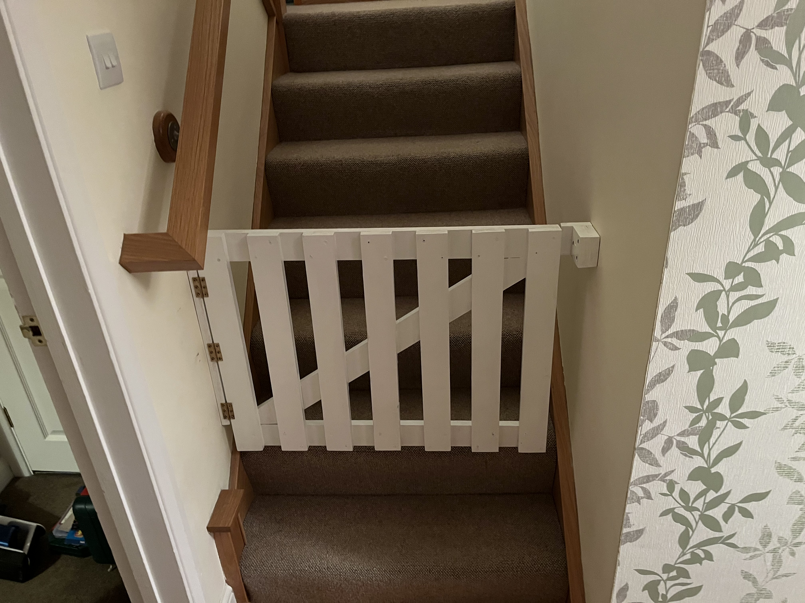

### On evaluation

I'm fairly pleased with the gate's fairly straightforward, functional design. To mount it on the wall I placed a piece of wood on the wall and used my wood drill bit to drill through it and only a little into the wall to mark it. Then, on the masonry setting I drilled much bigger holes for rawlplugs. Initially I only used three screws but some weeks later, after my dog had rested her paws on the gate a number of times and seeing it drop a few millimeters at the bolt end, I added another two.

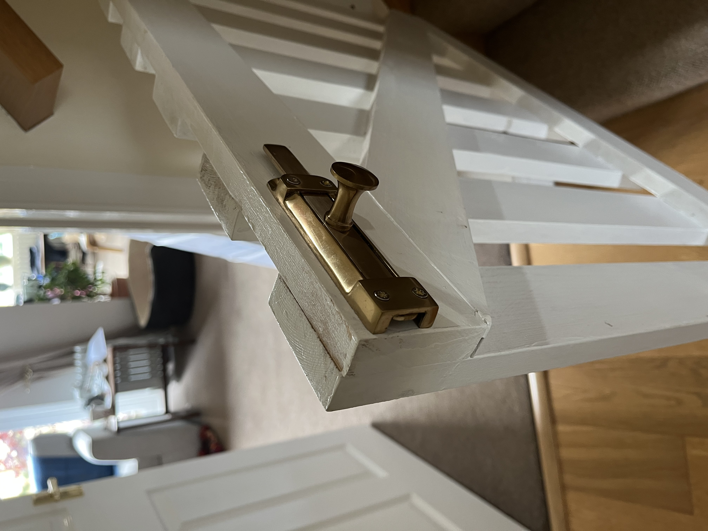

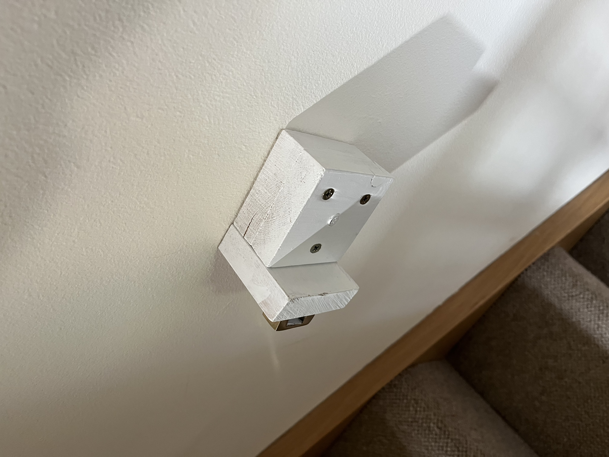
For the bolt, I imrovised a fixing made of two perpendicular pieces, fixed to the wall with three rawlplugs. This part of the gate was the least secure. There's about 1mm of clearance from the gate frame but Jenny and I like that we can often rest the gate in the closed position without locking it, so the dog can come downstairs if we want to give her the option.

We chose to paint the gate with white Dulux satinwood paint. I didn't realise that I probably should have used a primer, but actually the paint took well. I rushed this part because I was so excited to mount and use my gate and perhaps, on reflection, shouldn't have. This becomes a recurring theme in my other projects; overcome with excitement I often rush the decorating part, compromising the finish.

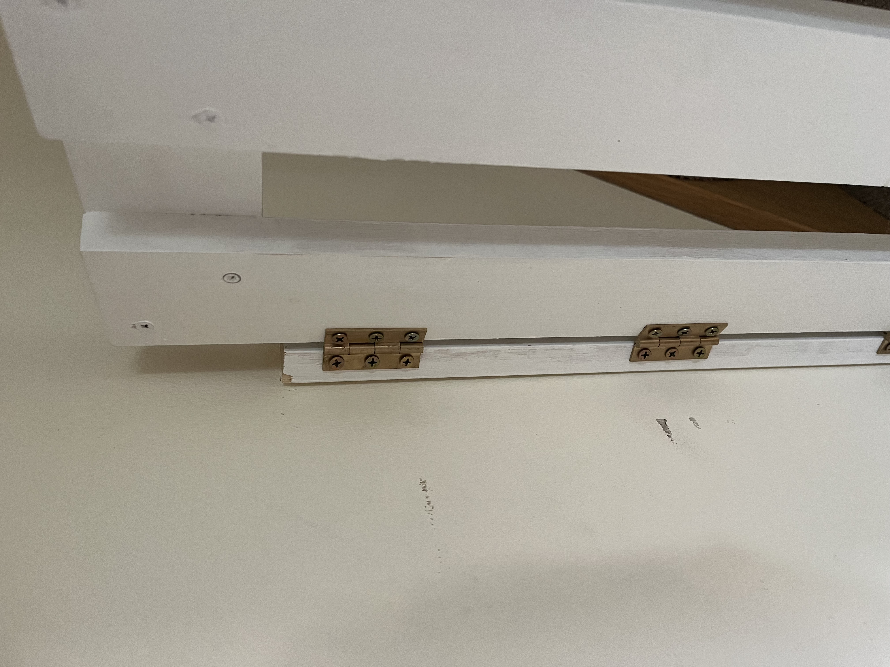
(The drill scraped a little of the wall as I was fixing the hinges. Unfortunately we don't have any of the paint the previous owner used for this hallway.)

## Patio raised bed

With my newfound woodworking confidence I wanted to take on another project. In June, we had our patio renovated and had asked that a small space be left for a raised bed.

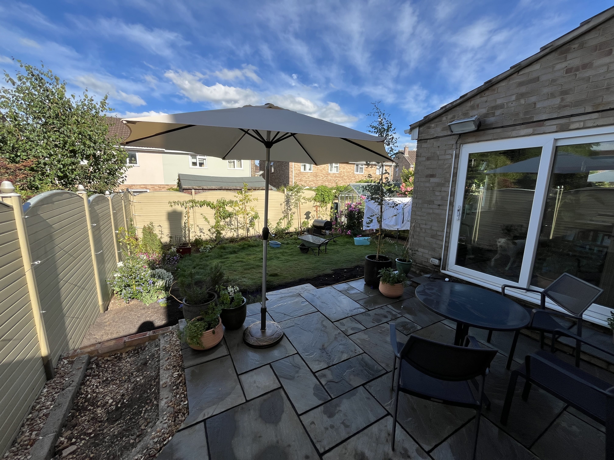

Once again, with very low expectations I watched some more YouTube videos. Through this video I was introduced to the excellent, highly-produced work of Stuart at "Proper DIY". His video on raised sleeper beds exposed me to a little more "technicality" than I had perhaps experienced on the gate project but features some lovely touches, like using some trim to fold the waterproof lining over, for clean edges.

    <iframe src="https://www.youtube.com/embed/v_gDrvhty98" 
        title="Transform Your Garden With Smart Raised Sleeper Beds!" frameborder="0" allowfullscreen
        allow="accelerometer; autoplay; clipboard-write; encrypted-media; gyroscope; picture-in-picture">
    </iframe>

On this project I had bought some 200 by 100 by 2400 railway sleepers from Bradfords, another builders merchant near where we live in Somerset. Unfortunately some of these were twisted, which made some aspects of the project tricky later on.

### New tools

For this project I bought myself a Bosch Cordless circular saw. Initially I was nervous about potentially severing one of my limbs with its spinning blade but quicky realised that, with its guard, it would be very difficult to hurt myself with. It made sense for me to buy the battery-operated UniversalCirc saw because I'd be doing most of my work outside, but in retrospect a corded saw and extension cable also would have worked fine.

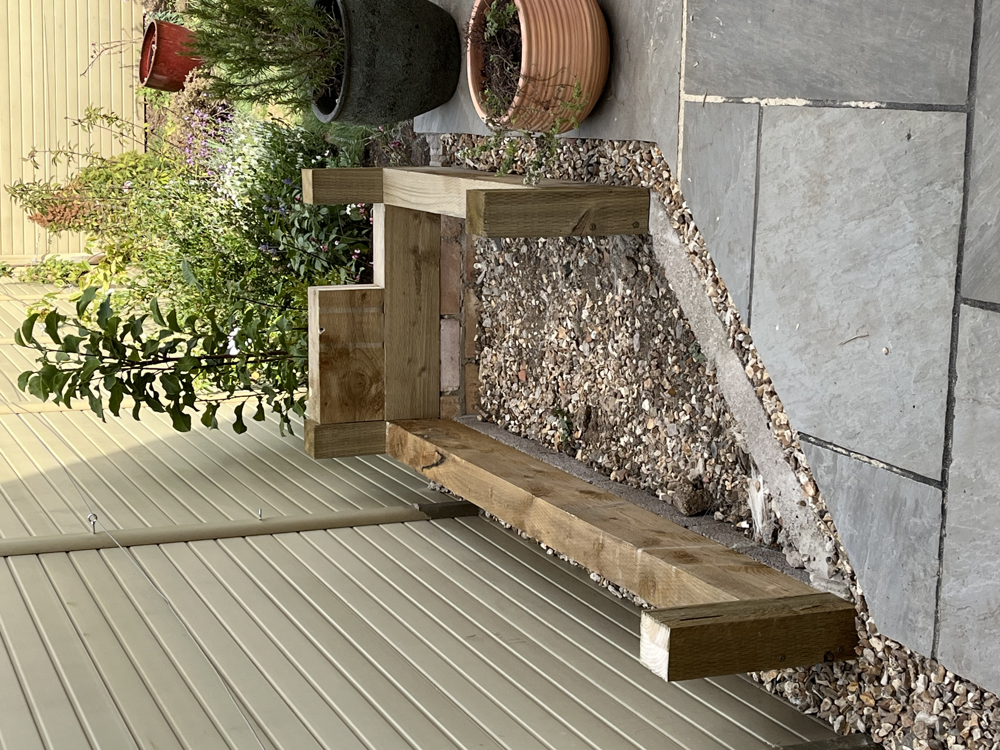

The UniversalCirc cut through the sleepers reasonably well but after spending whole days in the sun, its batteries would quickly overheat. I bought a much larger 4ah 18v battery for this project so that I could work for longer, however if I could go back, I would have invested in the "professional" Bosch range, which features much more powerful tools; the DIY and the Pro Bosch battery systems are unfortunately incompatible. I read a comment recently that said something to the effect of "buying new tools means we have outgrown the old ones"; the DIY range of tools has served me pretty well.

In my design I had planned to stack three railway sleepers on their short side but in the build decided two was enough. I had toyed with the idea of the sleepers connecting to each other but I'd also bought some 100 by 100 fence posts, having also imagined a design in which these posts sit on each corner. The latter turned out to be the more feasible because, as I mentioned earlier, many of the sleepers were twisted.

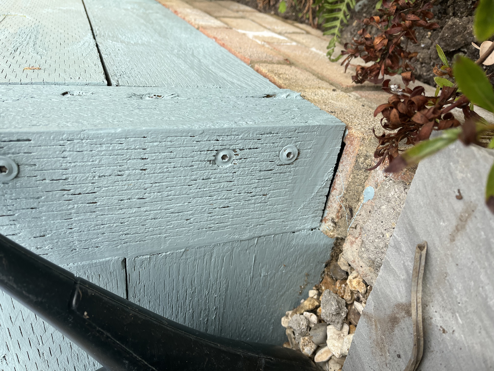

I began the project by using a hammer & chisel (lended to us by Jenny's mum) to clear out all the excess concrete on the breezeblocks that the bed would sit on. One challenge with the design was that the end of the bed (made of brick) was slightly higher than the breezeblocks. This meant I had to cut the end posts and bottom end sleeper slightly shorter.

Cutting the sleepers was difficult because my saw's maximum cutting depth was 50mm and the sleepers were 100, so I would have to mark my cuts on both sides, then flip it over. On some pieces my cuts were so poor I had to discard them altogether.

### Tricky cuts

While the patio builder had left a 45 degree angle in the breezeblocks, I poorly judged where my end posts would sit and consequently had to cut a more acute angle for my diagonal piece. As you'll see in the following images, my cuts were so poor I had to create a sort of "shim" and fill the gaps with loads of filler. It's "functional" but a little more planning might have produced a better finish.

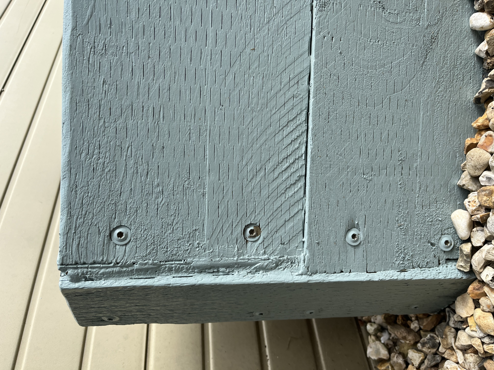

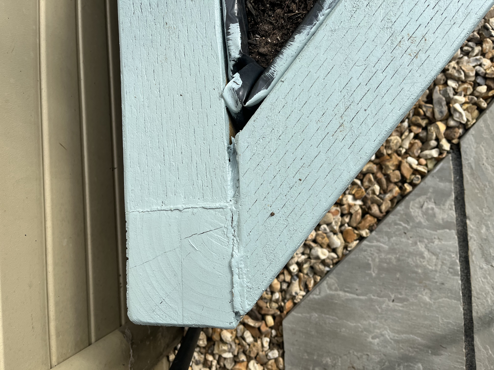

It's worth mentioning just how much more _physical_ this project was than the last. The sleepers were especially heavy, so every flip, every adjustment required me to lift the piece. Equally, driving 150mm screws through each of the posts required a lot of force. I should mention that, invariably I'm using the drill setting on the slow speed of my combi-drill to drive screws in, rather than the screw setting. I still don't fully understand why the drill setting has so much more strength than the screw setting; I'd love someone to explain why this is.

I completed most of the bottom half of the project in one first weekend, then resumed a few weekends later. While the wood is weather-treated, I didn't have to worry about it raining because the UK was experiencing the first of several heatwaves.

Once the frame was complete, I sanded the corners with another of my new purchases: an orbital sander (also in the Bosch DIY range) to remove sharp edges and splinters. Jenny then coated it all in Ronseal and painted the whole piece in a rather lovely (weatherproof) eggshell blue paint. The extra Ronseal step might have been unnecessary but, with how tired this project made me, the idea of having to rebuild the bed next year was not one I embraced.

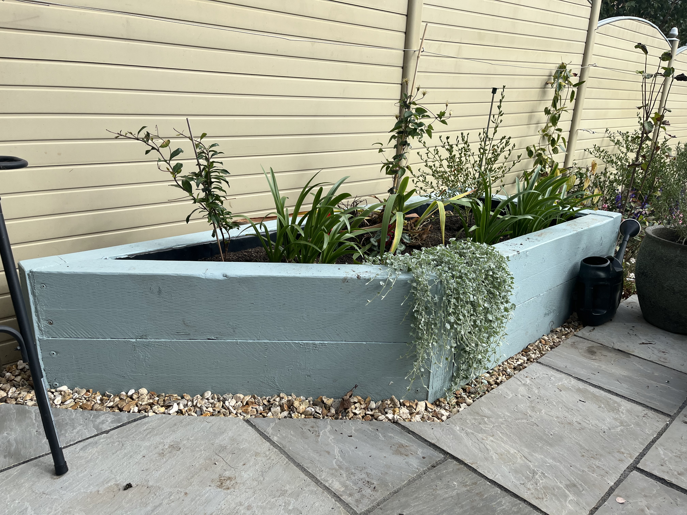

## Alcove shelves

When one has an ever-expanding Blu-ray collection (as I do), storage space is in high demand. Jenny and I wanted to make the most of the space either side of our living room's fireplace to relieve our bookcase of Blu-rays and books.

Again, turning to YouTube, I found some excellent tutorials. This one, by a professional carpenter explained all of the important technical qualities.

    <iframe src="https://www.youtube.com/embed/8fFn82p2W9I" 
        title="Making 50mm Thick Floating Shelves On Site (Baton Framework Method) Try This..." frameborder="0" allowfullscreen
        allow="accelerometer; autoplay; clipboard-write; encrypted-media; gyroscope; picture-in-picture">
    </iframe>

Importantly, it mentioned that alcoves are not usually perfectly square. I would need to measure each wall if I wanted similiarly sized shelves. I would also need to "scribe" the shape of the wall onto the pieces of MDF I was using for a neat fit.

The following video from "Rag 'n' Bone Brown" also features the scribing technique. Jenny and I love his "Junk Hunt" series, in which he finds discarded scrap wood and recycles it into useable furniture.

    <iframe src="https://www.youtube.com/embed/bNF16OR0NWY" 
        title="Scribe Fitting An Alcove Shelf" frameborder="0" allowfullscreen
        allow="accelerometer; autoplay; clipboard-write; encrypted-media; gyroscope; picture-in-picture">
    </iframe>

For this project, I ordered most of my wood from Sydenhams. Because some items were out of stock at our local branch, it took about two weeks to arrive. I had chosen some thicker softwood to as front pieces, with a planed width matching that of the full constructed height of the shelf but what arrived was unfortunately about 2mm thinner. Because I had blocked out a weekend for the project, I chose to push on. Jenny assured me that we could make the appearance of this gap less noticeable with decorator's caulk.

Building out my first shelf was surprisingly straightforward. I drilled through each wooden baton, marking the wall for drilling into the masonry (as I did when I mounted my gate.) I then measured and cut three perpendicular batons to spread the weight of heavy books and provide extra structural support.

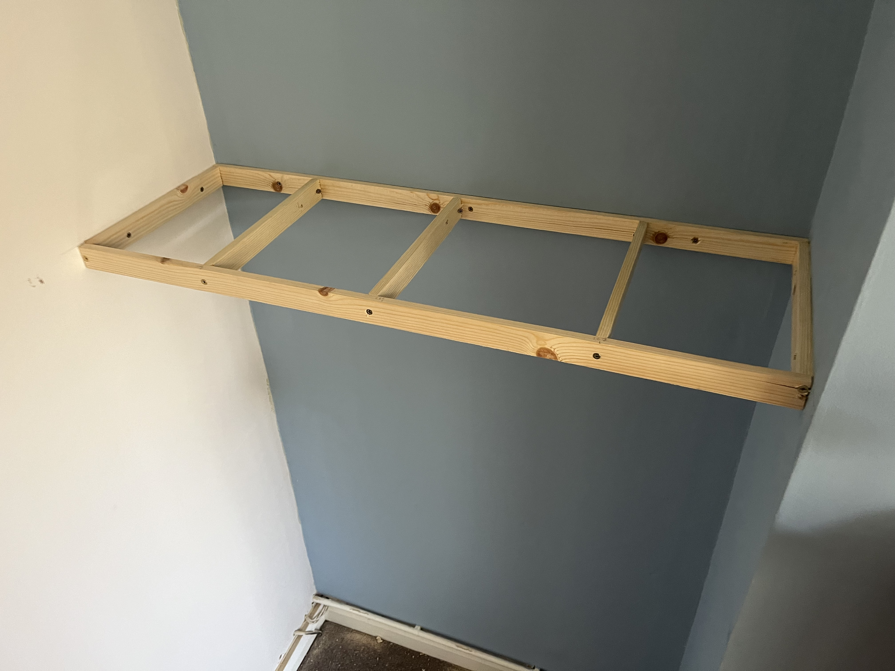

I used 6mm MDF on the tops and bottoms of each shelf, measuring with the aforementioned scribing technique and cut with my circular saw. I "pinned" each shelf to the frame with short screws, counter-sinking each screw hole so that later I could fill over the top. I didn't want to have to buy a nailgun for this project, but with the glue dripping from the frame as I attempted to pin each sheet of MDF in place, one probably would have made the process much less painful, especially on the shelf undersides.

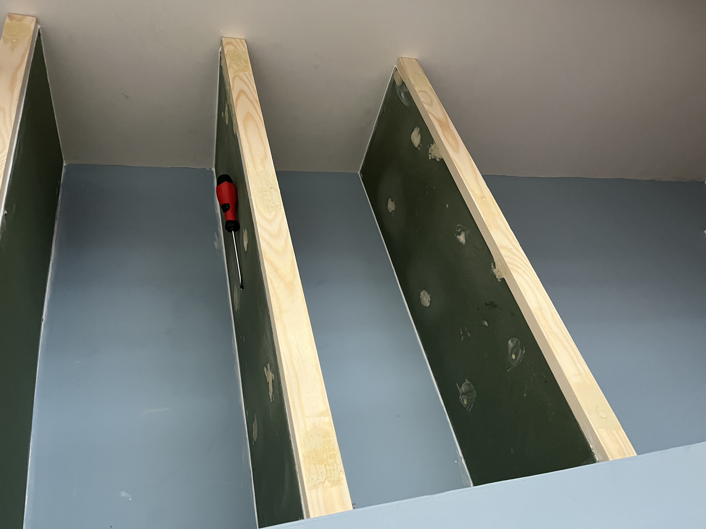

After filling & sanding, Jenny and I painted our shelves first using two coats of a wood primer, then a topcoat of what was left of our satinwood. 

I'm overall very pleased with the sheer practicality of these shelves. Unlike in videos, I chose to make them 300mm deep so we could double-stack Blurays and books. With a rough calculation I estimate that they could support up to 20kg in weight!

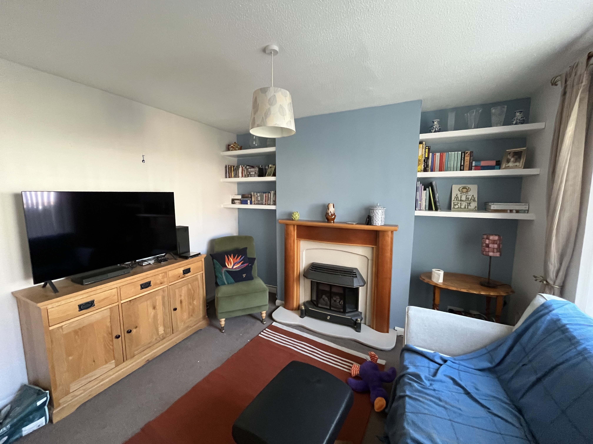

### On evaluation

Much like on my gate project, in the excitement of seeing my shelves manifest, imagining my physical media spread across them, I rushed the sanding and filling process. In angled lamplight, it's possible to see the edges of some of the screwholes I hastily filled and sanded, visible in the following picture.

I went into each project with very low expectations and in each one I ended up "winging" some aspect; not as any "professional" would do but just a guy DIY-ing around his house. I've created things that I never thought possible.

It was on this project that I noticed, while I can point out its deficiencies, I'm perfectly satisfied with "good enough". Perhaps, when it comes to DIY, I'll always be a "good enough" guy.

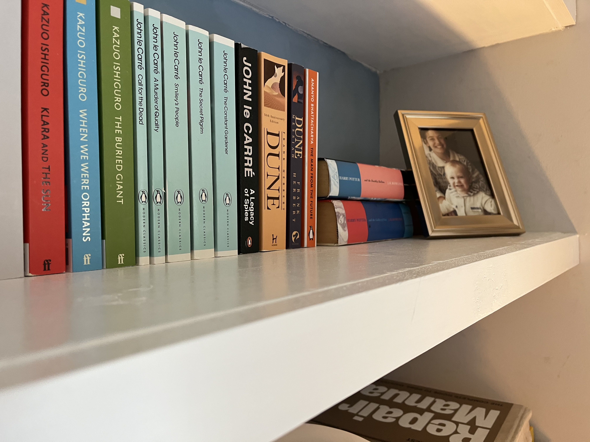

## Workbench

This weekend I've been building a workbench so I can continue my DIY & woodworking projects. One of the things I learned on the alcove shelves was just how unbearable cutting sheet materials on the floor is; in my case raised on bits of scrap railway sleeper. Most sheet materials come in a 2440 by 1220 size, which one must cut down to something useable. With my workbench, I hope to be able to work at a comfortable height.

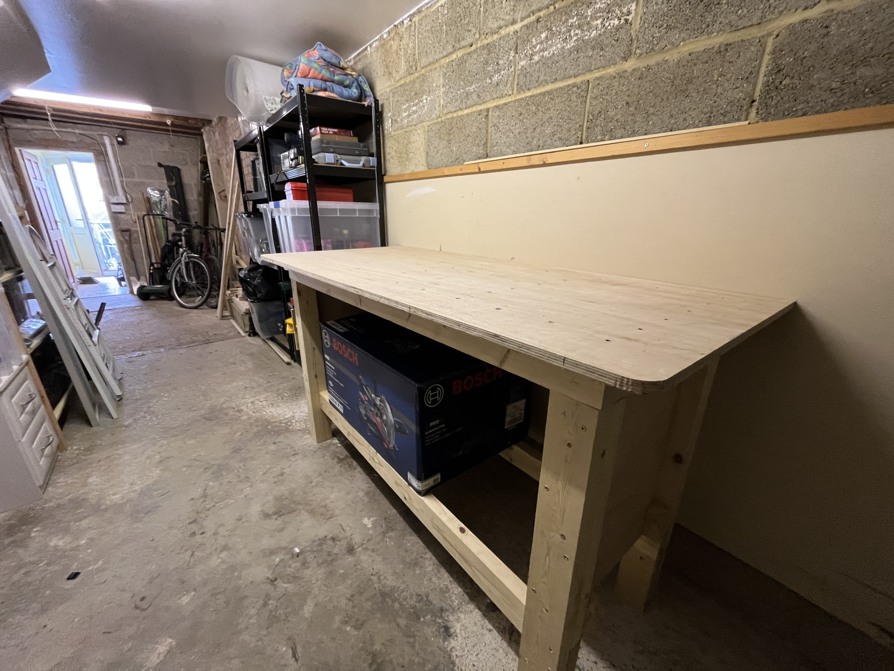

For this project I once again enlisted the help of Stuart at Proper DIY. I decided to extend Stuart's simple workbench design with a 100mm overhang on each side for easy clamping. Remembering Sydenhams' slow delivery, I ordered the wood for this project from Bradford. Unfortunately, after a whole kerfuffle in which they delivered the wrong product three times, much of the correct wood I received was twisted. 

    <iframe src="https://www.youtube.com/embed/O16pe3NiUaU" 
        title="How to Build an Easy, Sturdy Workbench" frameborder="0" allowfullscreen
        allow="accelerometer; autoplay; clipboard-write; encrypted-media; gyroscope; picture-in-picture">
    </iframe>

Again, having blocked out a weekend I decided to push on with the project. Part of me really wishes I hadn't; it caused lots of headaches.

Earlier this week I took receipt of my new Bosch Pro GCM 305-216 S miter saw and stand (costing only £314 altogether!) I knew that the workbench would warrant lots of clean, repeatable cuts and so far I've been very impressed with its quality. The GTA 2600 stand is much more solid than I'd imagined.

Jenny and I also recently purchased a Titan "shop vac" from Screwfix, which we've used to hoover up soil and sawdust from the garage floor. We can't believe how something so cheap has such vastly superior suction power; I don't exaggerate when I say our quality of life has been improved.

On this project I tried using a (newly acquired) jig for drilling tidy pocket screw holes. While the finish is very good, I got frustrated with the tedium of reclamping and repositioning my workpiece and instead defaulted to using the "turning drill" technique you can see in Stuart's workbench video. It's much quicker and in all likelihood nobody's ever going to see the screwholes on the inside of my workbench but me.

I'm looking forward to attaching a vice to the bench and possibly adding castors on the feet so that I can reposition it to the middle of our garage for cutting larger sheet materials. It is however, very structurally secure.

I'm very proud of what I've been able to accomplish with these projects in only a few months. As I'm sure other homeowners can attest, there are always things that need making or fixing. It's fair to say I have taken to my new occupation well.

